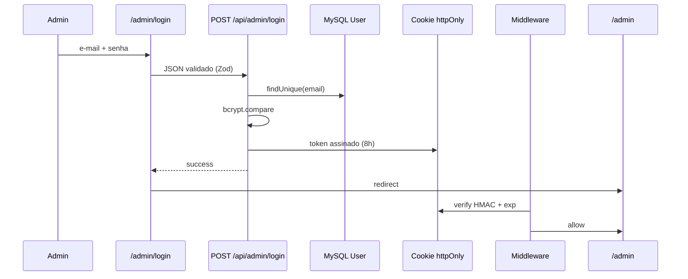

# Relatório — Fase 10: Autenticação Admin, Dashboard e Proteção de Rotas

**Projeto:** Nangell Creative Studio — Site Institucional e Comercial  
**Data/hora:** 2026-06-21  
**Responsável:** AGENT — Admin Auth & Dashboard

---

## 1. Resumo executivo

A Fase 10 implementou a base da área administrativa: login em `/admin/login`, sessão segura via cookie httpOnly assinado (HMAC-SHA256), middleware de proteção, APIs de login/logout, dashboard em `/admin` e layout admin premium com sidebar responsiva.

**Build:** ✅ Sucesso (41 rotas + Proxy/Middleware)  
**Biblioteca de auth externa:** ❌ Não utilizada (sessão customizada — ver seção 3)

---

## 2. Rotas implementadas

| Rota | Tipo | Função |
|------|------|--------|
| `/admin/login` | Estática | Formulário de login |
| `/admin` | Dinâmica | Dashboard principal |
| `/admin/leads` | Dinâmica | Placeholder Fase 11 |
| `/admin/projetos` | Dinâmica | Placeholder Fase 11 |
| `/admin/servicos` | Dinâmica | Placeholder Fase 11 |
| `/admin/depoimentos` | Dinâmica | Placeholder Fase 11 |
| `/admin/blog` | Dinâmica | Placeholder Fase 11 |
| `/admin/configuracoes` | Dinâmica | Placeholder Fase 11 |
| `POST /api/admin/login` | API | Autenticação |
| `POST /api/admin/logout` | API | Encerramento de sessão |

---

## 3. Arquitetura de autenticação

### Decisão: sessão customizada (sem NextAuth/jose)

**Motivo:** escopo da fase exige cookie httpOnly assinado simples, compatível com Edge Middleware e sem dependências extras. A implementação usa **Web Crypto API** (`crypto.subtle` HMAC-SHA256), funcionando tanto no middleware (Edge) quanto nas API Routes (Node).

### Fluxo



### Cookie de sessão

| Propriedade | Valor |
|-------------|-------|
| Nome | `nangell_admin_session` |
| Formato | `{base64url(payload)}.{hmac_signature}` |
| Payload | `userId`, `email`, `name`, `role`, `exp` |
| httpOnly | ✅ |
| sameSite | `lax` |
| secure | ✅ em produção |
| maxAge | 8 horas |

### Segredo

Variável `ADMIN_SESSION_SECRET` (`.env.example` atualizado). Obrigatória em produção — lança erro se ausente.

### Arquivos

| Arquivo | Responsabilidade |
|---------|------------------|
| `src/lib/auth/session.ts` | Criar/verificar token, opções do cookie |
| `src/lib/auth/get-server-session.ts` | Sessão em Server Components |
| `src/lib/auth/middleware-utils.ts` | Helpers + registro de tentativas inválidas |
| `src/lib/validations/admin-auth.ts` | Schema Zod do login |
| `src/middleware.ts` | Proteção de rotas `/admin/*` |

---

## 4. Login

**Componente:** `src/app/_components/admin/admin-login-form.tsx`

| Requisito | Implementação |
|-----------|---------------|
| Campos e-mail e senha | ✅ React Hook Form + Zod |
| Loading | ✅ Estado `isSubmitting` |
| Erro genérico | ✅ Mesma mensagem para e-mail/senha inválidos |
| Não revelar se e-mail existe | ✅ Resposta 401 uniforme |
| Visual da marca | ✅ Logo Nangell + glass card dark |
| Botão Entrar | ✅ |

**Credenciais seed (Fase 2):**

- E-mail: `admin@nangell.com.br`
- Senha: `NangellAdmin@2026`

---

## 5. Tentativas inválidas

Mecanismo simples em memória (`src/lib/auth/middleware-utils.ts`):

| Parâmetro | Valor |
|-----------|-------|
| Chave | `{IP}:{email}` |
| Janela | 15 minutos |
| Bloqueio | Após 10 tentativas inválidas |
| Resposta | HTTP 429 + mensagem genérica |

> Reinicia a cada deploy/restart — adequado para dev; produção pode usar Redis.

---

## 6. Middleware

**Arquivo:** `src/middleware.ts`  
**Matcher:** `/admin/:path*`

| Cenário | Comportamento |
|---------|---------------|
| `/admin/login` sem sessão | Permite acesso |
| `/admin/login` com sessão válida | Redirect → `/admin` |
| `/admin/*` sem sessão | Redirect → `/admin/login?redirect=...` |
| Assets/API públicas | Fora do matcher — não bloqueadas |

---

## 7. Dashboard `/admin`

**Componente:** `src/app/_components/admin/admin-dashboard-content.tsx`  
**Dados:** `src/services/admin-dashboard-service.ts` (Prisma)

### Cards de estatísticas

- Total de leads
- Leads novos (status `NOVO`)
- Projetos publicados
- Posts publicados
- Cases com demo (`demoRoute` não nulo)

### Tabela

- Últimos 5 leads (nome, e-mail, empresa, tipo, status, data)

### CTAs

- Gerenciar leads → `/admin/leads`
- Gerenciar portfólio → `/admin/projetos`
- Criar artigo → `/admin/blog`

---

## 8. Layout admin

| Componente | Arquivo |
|------------|---------|
| Shell | `src/components/admin/admin-layout.tsx` |
| Sidebar | `src/components/admin/admin-sidebar.tsx` |
| Topbar | `src/components/admin/admin-topbar.tsx` |
| Stat card | `src/components/admin/admin-stat-card.tsx` |
| Placeholder | `src/components/admin/admin-placeholder.tsx` |

### UX

- Dark premium alinhado ao design system Nangell
- Sidebar fixa (desktop) + drawer mobile
- Topbar com nome/e-mail, link “Ver site”, botão Sair
- Header/footer públicos ocultos em `/admin/*` via `SiteChromeGate`

---

## 9. Logout

`POST /api/admin/logout`:

- Remove cookie (`maxAge: 0`)
- Client redireciona para `/admin/login`

---

## 10. Resultado do build

```
npm run build
✓ Compiled successfully
✓ Generating static pages (41/41)

ƒ /admin
○ /admin/login
ƒ /api/admin/login
ƒ /api/admin/logout
ƒ Proxy (Middleware)
```

**Observação:** Next.js 16 emite aviso de depreciação do convention `middleware` em favor de `proxy` — funcional, sem impacto nesta fase.

---

## 11. Testes manuais recomendados

| Teste | Resultado esperado |
|-------|-------------------|
| Login correto | Cookie setado → redirect `/admin` |
| Login incorreto | Mensagem genérica, HTTP 401 |
| Acesso direto `/admin` sem cookie | Redirect `/admin/login` |
| Logout | Cookie removido → login |
| Refresh com sessão válida | Permanece autenticado (< 8h) |
| 10+ tentativas inválidas | HTTP 429 |
| `/admin/leads` sem sessão | Redirect login |

---

## 12. Limitações e próximos passos

| Item | Detalhe |
|------|---------|
| CRUD admin | Páginas secundárias são placeholders (Fase 11) |
| Rate limit login | Em memória |
| Rotação de sessão | Não implementada nesta fase |
| 2FA | Fora do escopo |
| Roles | `ADMIN`/`EDITOR` no token — RBAC fino na Fase 11 |

---

## 13. Arquivos criados/alterados

```
src/
├── middleware.ts
├── app/
│   ├── admin/
│   │   ├── page.tsx
│   │   ├── login/page.tsx
│   │   ├── leads/page.tsx
│   │   ├── projetos/page.tsx
│   │   ├── servicos/page.tsx
│   │   ├── depoimentos/page.tsx
│   │   ├── blog/page.tsx
│   │   └── configuracoes/page.tsx
│   ├── api/admin/login/route.ts
│   ├── api/admin/logout/route.ts
│   └── _components/admin/
│       ├── admin-login-form.tsx
│       └── admin-dashboard-content.tsx
├── components/
│   ├── admin/
│   │   ├── admin-layout.tsx
│   │   ├── admin-sidebar.tsx
│   │   ├── admin-topbar.tsx
│   │   ├── admin-stat-card.tsx
│   │   └── admin-placeholder.tsx
│   └── global/site-chrome-gate.tsx
├── lib/auth/
│   ├── session.ts
│   ├── get-server-session.ts
│   └── middleware-utils.ts
├── lib/validations/admin-auth.ts
├── services/admin-dashboard-service.ts
└── app/layout.tsx (SiteChromeGate)
.env.example (ADMIN_SESSION_SECRET)
```

---

**Fase 10 concluída.** Área admin protegida, login seguro e dashboard operacional.
